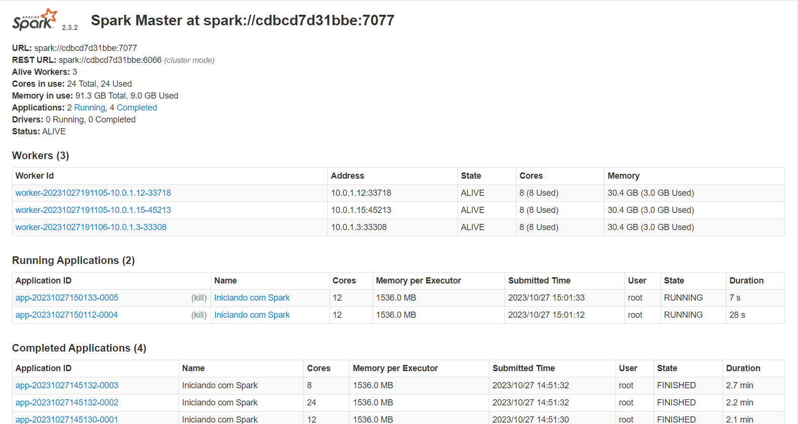
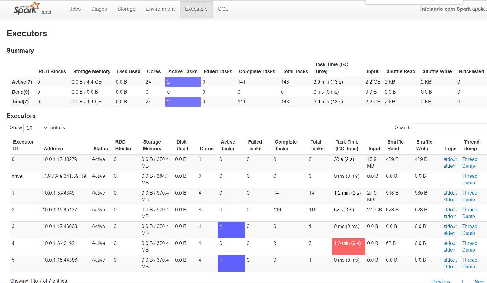
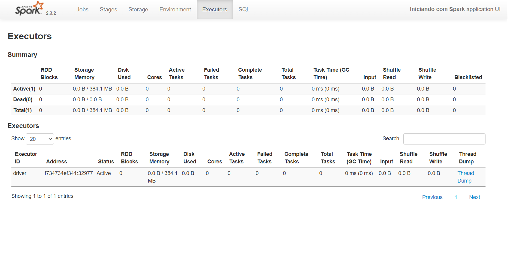

# Spark running into Spark Standalone cluster with History Server

Apache Spark is an open-source, distributed processing system used for big data workloads.

In this demo, a Spark container uses a Spark Standalone cluster as a resource management and job scheduling technology to perform distributed data processing.

This Docker image contains Spark binaries prebuilt and uploaded in Docker Hub.


## Start Swarm cluster

1. start swarm mode in node1
```shell
$ docker swarm init --advertise-addr <IP node1>
$ docker swarm join-token worker  # issue a token to add a node as worker to swarm
```

2. add 3 more workers in swarm cluster (node2, node3, node4)
```shell
$ docker swarm join --token <token> <IP nodeN>:2377
```

3. label each node to anchor each container in swarm cluster
```shell
docker node update --label-add hostlabel=hdpmst node1
docker node update --label-add hostlabel=hdp1 node2
docker node update --label-add hostlabel=hdp2 node3
docker node update --label-add hostlabel=hdp3 node4
docker node update --label-add hostlabel=hdp4 node5
```

4. create an external "overlay" network in swarm to link the 2 stacks (hdp and spk)
```shell
docker network create --driver overlay mynet
```

5. start a spark standalone cluster
```shell
$ docker stack deploy -c docker-compose.yml spk
$ docker service ls
ID             NAME          MODE         REPLICAS   IMAGE                                     PORTS
8ttdgw6b6j7a   spk_spk1      replicated   1/1        mkenjis/spark_hadoop_cluster_img:latest   
aukf7pb7rqbk   spk_spk2      replicated   1/1        mkenjis/spark_hadoop_cluster_img:latest   
zxze0lvd22j0   spk_spk3      replicated   1/1        mkenjis/spark_hadoop_cluster_img:latest   
s37ty1zze0y0   spk_spk_cli   replicated   1/1        mkenjis/ubspkcli_yarn_img:latest          *:4040-4042->4040-4042/tcp
s6y8jcpe4adt   spk_spkmst    replicated   1/1        mkenjis/spark_hadoop_cluster_img:latest   *:8080->8080/tcp```

6. in spark/hadoop master node, load datafile to run jobs
```shell
$ docker container exec -it <spk_spkmst ID> bash
$ hdfs dfs -mkdir /data
$ hdfs dfs -put adult.data /data
```

7. in spark client node, copy core-site.xml and hdfs-site.xml from spark/hadoop master into $SPARK_HOME/conf
```shell
$ docker container exec -it <spk_spk_cli ID> bash
$ cd $SPARK_HOME/conf
$ scp root@spkmst:/usr/local/hadoop-2.7.3/etc/hadoop/core-site.xml .
Warning: Permanently added 'hdpmst,10.0.1.11' (ECDSA) to the list of known hosts.
core-site.xml                                                              100%  137    78.1KB/s   00:00    
$ scp root@spkmst:/usr/local/hadoop-2.7.3/etc/hadoop/hdfs-site.xml .
hdfs-site.xml                                                              100%  310   292.6KB/s   00:00
```

8. edit hive-site.xml files
```shell
$ vi hive-site.xml

<configuration>
  <property>
    <name>hive.metastore.warehouse.dir</name>
    <value>hdfs://spkmst:9000/user/hive/warehouse</value>
  </property>
</configuration>
```

9. edit spark-defaults.conf and add following lines
```shell
$ vi spark-defaults.conf

spark.eventLog.enabled true
spark.eventLog.dir  hdfs://spkmst:9000/spark-logs
spark.history.fs.logDirectory  hdfs://spkmst:9000/spark-logs

```

10. start spark history server and access port 18080 as shown
```shell
$ start-history-server.sh
starting org.apache.spark.deploy.history.HistoryServer, logging to /usr/local/spark-2.3.2-bin-hadoop2.7/logs/spark--org.apache.spark.deploy.history.HistoryServer-1-939f7f90538d.out
$ tail -f /usr/local/spark-2.3.2-bin-hadoop2.7/logs/spark--org.apache.spark.deploy.history.HistoryServer-1-939f7f90538d.out
2023-09-24 15:45:59 INFO  Server:351 - jetty-9.3.z-SNAPSHOT, build timestamp: unknown, git hash: unknown
2023-09-24 15:45:59 INFO  Server:419 - Started @4138ms
2023-09-24 15:45:59 INFO  AbstractConnector:278 - Started ServerConnector@3c1e23ff{HTTP/1.1,[http/1.1]}{0.0.0.0:18080}
2023-09-24 15:45:59 INFO  Utils:54 - Successfully started service on port 18080.
2023-09-24 15:45:59 INFO  ContextHandler:781 - Started o.s.j.s.ServletContextHandler@654b72c0{/,null,AVAILABLE,@Spark}
2023-09-24 15:45:59 INFO  ContextHandler:781 - Started o.s.j.s.ServletContextHandler@5aa6202e{/json,null,AVAILABLE,@Spark}
2023-09-24 15:45:59 INFO  ContextHandler:781 - Started o.s.j.s.ServletContextHandler@3af9aa66{/api,null,AVAILABLE,@Spark}
2023-09-24 15:45:59 INFO  ContextHandler:781 - Started o.s.j.s.ServletContextHandler@6826c41e{/static,null,AVAILABLE,@Spark}
2023-09-24 15:45:59 INFO  ContextHandler:781 - Started o.s.j.s.ServletContextHandler@72889280{/history,null,AVAILABLE,@Spark}
2023-09-24 15:45:59 INFO  HistoryServer:54 - Bound HistoryServer to 0.0.0.0, and started at http://939f7f90538d:18080
```

11. create job script and 2 copies to run simultaneously
```shell
$ cat >adult_lreg_pred.py
$ mkdir dir1
$ mkdir dir2
$ cp adult_lreg_pred.py dir1
$ cp adult_lreg_pred.py dir2
```

12. before spark-submiting, install numpy
```shell
$ apt-get update
$ apt-get install curl
$ curl https://bootstrap.pypa.io/pip/2.7/get-pip.py --output get-pip.py
$ python2 get-pip.py
$ pip2 install numpy
```

12. run spark-submit in 3 different threads
```shell
$ (/dir1) spark-submit --executor-cores 4 --total-executor-cores 12 --master spark://cdbcd7d31bbe:7077 adult_lreg_pred.py
$ (/dir2) spark-submit --executor-cores 4 --total-executor-cores 24 --master spark://cdbcd7d31bbe:7077 adult_lreg_pred.py
$ spark-submit --executor-cores 4 --total-executor-cores 8 --master spark://cdbcd7d31bbe:7077 adult_lreg_pred.py
```


13. in the browser, issue the address https://host:8080 to access standalone UI




14. in the browser, issue the address https://host:4040 (:4041, :4042) to access spark UI of each run






